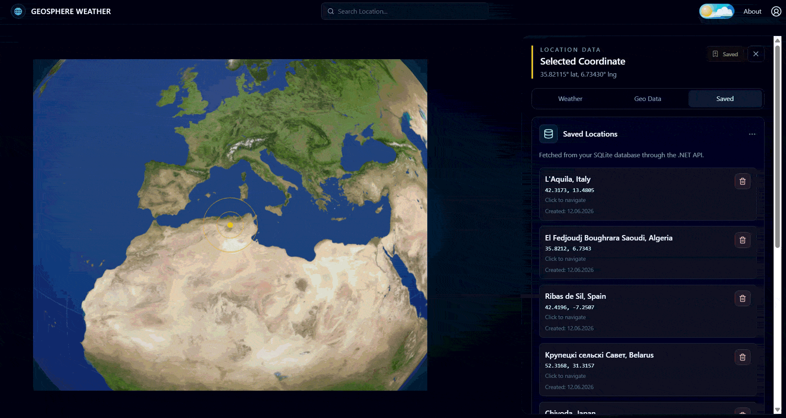
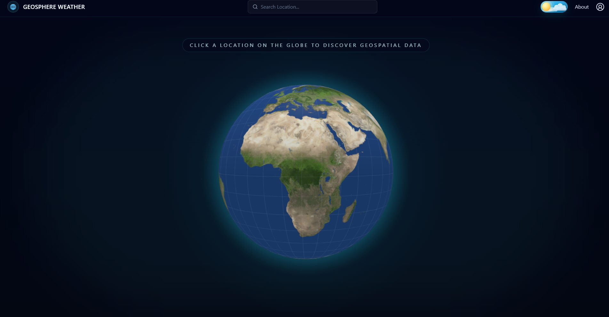
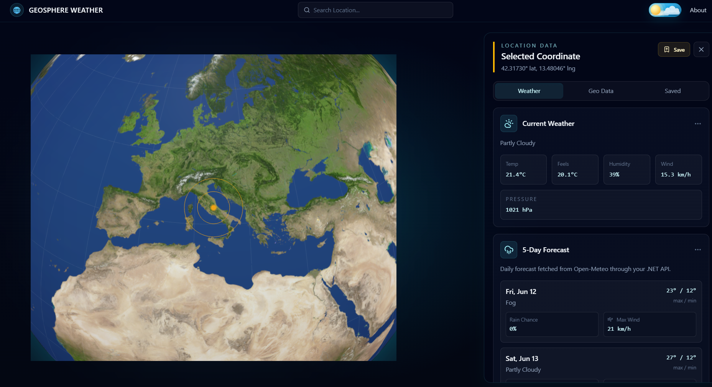
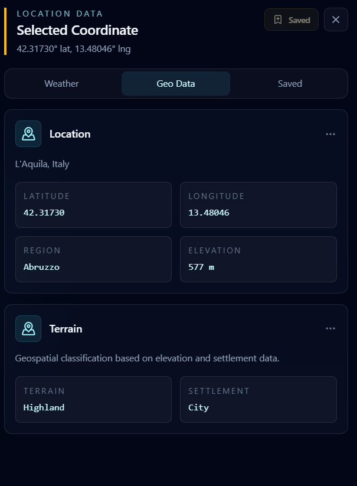
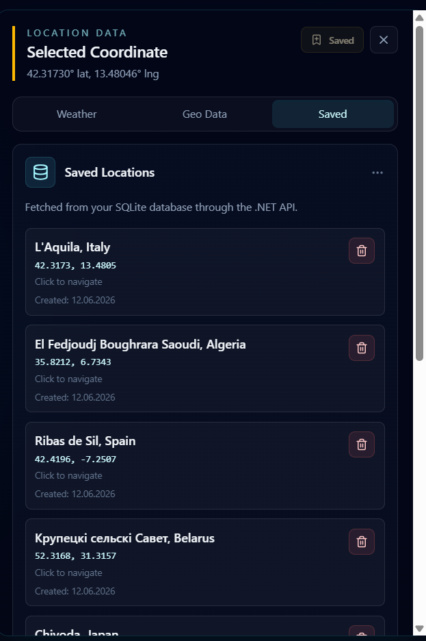
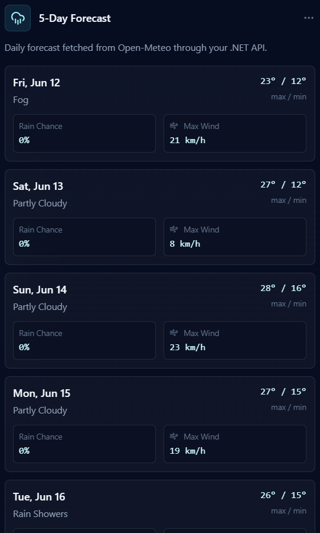

# GeoSphere Weather

GeoSphere Weather is a full-stack weather and geospatial dashboard built around an interactive 3D globe. The application allows users to select locations on the globe, search for cities, view current weather conditions, check a 5-day forecast, inspect geospatial data, and save favorite locations locally.

This project was built as a portfolio project to demonstrate full-stack development, API integration, interactive frontend design, and backend persistence with a clean project structure.

## Demo



## Screenshots

### Main Globe View



### Weather Dashboard



### Geospatial Data



### Saved Locations



### 5-Day Forecast



## Features

* Interactive 3D globe with selectable coordinates
* Location search with geocoding support
* Current weather data based on selected location
* 5-day weather forecast
* Geospatial details such as city, country, region, elevation, terrain type, and settlement type
* Favorite locations with save, delete, and navigate functionality
* Local SQLite persistence through a .NET Web API
* Responsive dashboard-style user interface

## Tech Stack

### Frontend

* React
* TypeScript
* Vite
* Tailwind CSS
* Framer Motion
* react-globe.gl
* lucide-react

### Backend

* ASP.NET Core Web API
* C#
* Entity Framework Core
* SQLite
* Clean Architecture-inspired project structure

### External APIs

* Open-Meteo Weather API
* Open-Meteo Elevation API
* Nominatim / OpenStreetMap Geocoding API

## Project Structure

```txt
GeoSphere/
├── client/                         # React frontend
├── GeoSphere.Api/                  # ASP.NET Core Web API
├── Server/src/GeoSphere.Application
├── Server/src/GeoSphere.Domain
└── Server/src/GeoSphere.Infrastructure
```

## Getting Started

Clone the repository:

```bash
git clone https://github.com/vixtorn/GeoSphere.git
cd GeoSphere
```

Create the frontend environment file:

```bash
cp client/.env.example client/.env.local
```

Create or update the local SQLite database:

```bash
dotnet ef database update --project ./Server/src/GeoSphere.Infrastructure/GeoSphere.Infrastructure.csproj --startup-project ./GeoSphere.Api/GeoSphere.Api.csproj
```

Run the frontend and backend together:

```bash
npm run dev
```

Frontend:

```txt
http://localhost:5173
```

Backend Swagger UI:

```txt
http://localhost:5276/swagger
```

## API Overview

```txt
GET    /api/weather/current
GET    /api/weather/forecast
GET    /api/geospatial/location
GET    /api/geospatial/search
GET    /api/favorite-locations
POST   /api/favorite-locations
DELETE /api/favorite-locations/{id}
```

## Notes

Local database files, environment files, build outputs, and large unused texture source files are excluded from version control through `.gitignore`.

## Credits

* Weather and forecast data: Open-Meteo
* Elevation data: Open-Meteo Elevation API
* Geocoding and reverse geocoding: Nominatim / OpenStreetMap
* Day/Night toggle visual inspiration: Colt4D5 — “Day & Night Toggle Button” on CodePen
